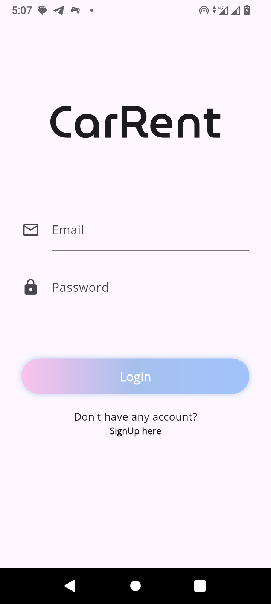
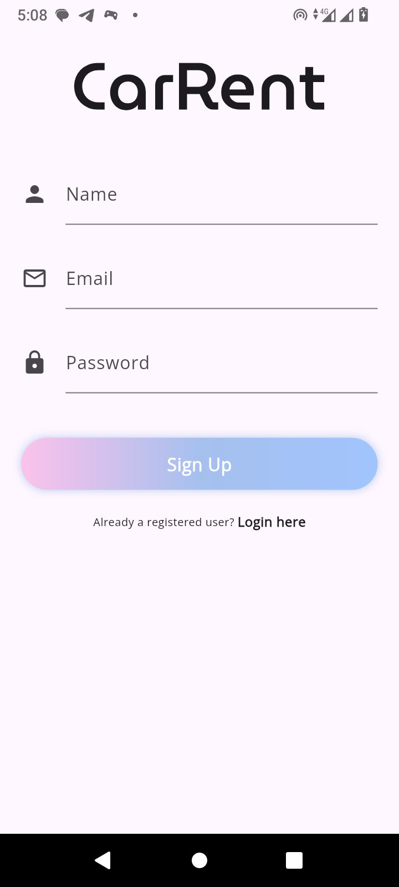
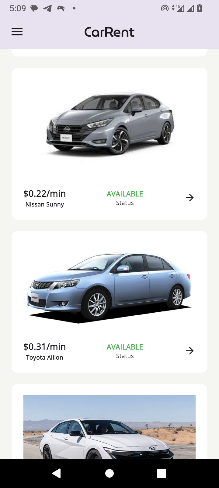
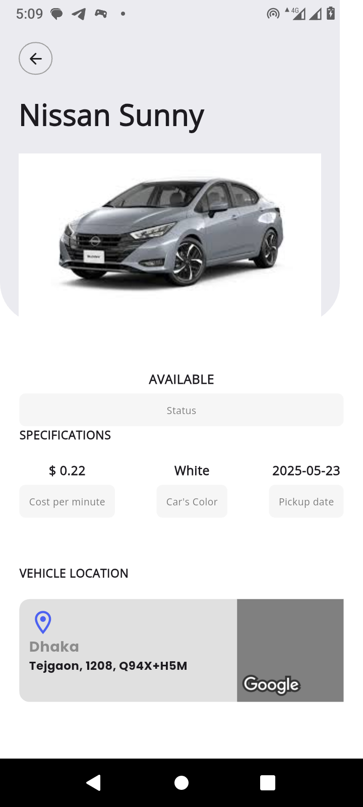

# Car Rental App

A modern and feature-rich car rental application built with Flutter, offering a seamless experience for users to browse, book, and manage car rentals.

## Features

- 🚗 Browse available cars with detailed information
- 📱 User authentication and profile management
- 📅 Booking management system
- 🗺️ Integration with Google Maps
- 📱 Responsive design for all platforms

## Screenshots






## Demo Video

[Add your demo video link here]

## Prerequisites

- Flutter SDK (version 3.7.2 or higher)
- Dart SDK (version 3.7.2 or higher)
- Android Studio / Xcode (for mobile development)
- VS Code (recommended IDE)
- Git
- Google Cloud Platform account (for Maps API)

## Getting Started

1. Clone the repository:
```bash
git clone [your-repository-url]
cd car_rental_app
```

2. Install dependencies:
```bash
flutter pub get
```

3. Set up environment variables:
   - Create a `.env` file in the root directory
   - Add your Google Maps API key and other required API keys

4. Generate necessary files:
```bash
flutter pub run build_runner build --delete-conflicting-outputs
```

5. Run the app:
```bash
flutter run
```

## Build Steps

### Android
```bash
flutter build apk --release
```

### iOS
```bash
flutter build ios --release
```

### Web
```bash
flutter build web --release
```

## Project Structure

```
lib/
├── core/           # Core functionality and utilities
├── data/           # Data layer (repositories, models)
├── domain/         # Business logic and entities
├── presentation/   # UI layer (screens, widgets)
└── main.dart       # Application entry point
```

## Dependencies

- **State Management**: GetX
- **Networking**: Dio, Retrofit
- **Storage**: Get Storage
- **Maps**: Google Maps Flutter
- **Location**: Geolocator
- **UI Components**: Google Fonts, Lottie
- **Dependency Injection**: GetIt, Injectable


## Environment Variables

| Variable | Description | Default |
|----------|-------------|---------|
| BASE_URL | api base url | localhost |
| GOOGLE_API_KEY | google map api key for android | - |
| GOOGLE_API_KEY_IOS | google map api key for ios | - |


## Contributing

1. Fork the repository
2. Create your feature branch (`git checkout -b feature/amazing-feature`)
3. Commit your changes (`git commit -m 'Add some amazing feature'`)
4. Push to the branch (`git push origin feature/amazing-feature`)
5. Open a Pull Request

## License

This project is licensed under the MIT License - see the LICENSE file for details.

## Contact

[Md. Riadul Islam] - [dev.riadul@gmail.com]

Project Link: [https://github.com/riad804/car_rental_app](https://github.com/riad804/car_rental_app)
